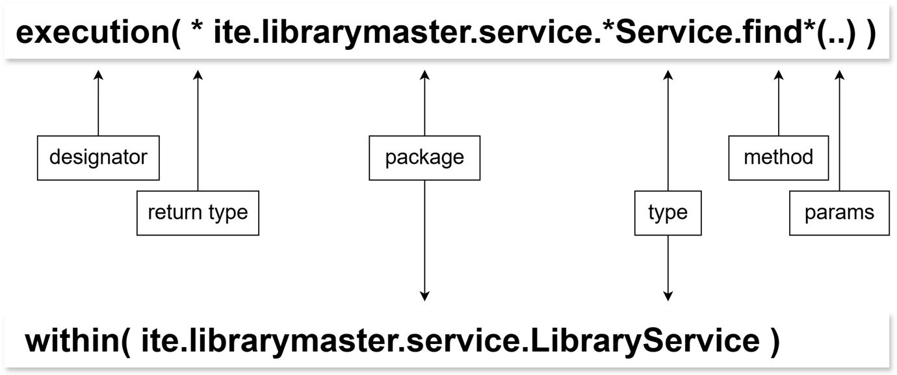
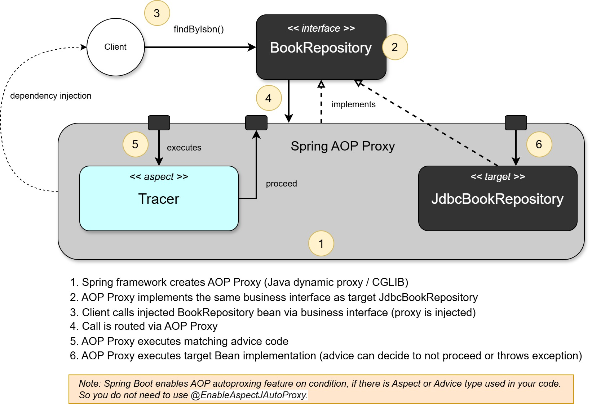

# AOP Concept
* Join Point
    * A point in execution of a program such as a method call or field assignment
* Pointcut
    * An expression that selects on or more Join Points
* Advice
    * Code to be executed at a Join Point that has been selected by a Pointcut
* Aspect
    * A module that encapsulates pointcuts and advice

## Defining pointcuts
* Spring AOP uses AspectJ’s pointcut expression language
* Spring AOP supports only method execution join points
* Common pointcut designator
    * _execution(<method pattern>)_
* Can be chained together to create composite
    * _&& (and), || (or), ! (not)_
* Method pattern
    * _[Modifiers] ReturnType [ClassType] MethodName ([Arguments]) [throws ExceptionType]_

Pointcut expression:



## Spring AOP Proxies
* Spring AOP uses standard J2SE dynamic proxies for interfaces
* It can also use CGLIB proxies to proxy classes



## Supported Advices

* Before Advice - _@Before_
    * Advice is executed before method invocation
    * If advice throws an exception, target will not be called

    ```Java
    @Aspect
    public class MethodExecutionTracker {
    // track all setter methods
        @Before("execution(void set*(..))")
        public void trackMethod() {
            // log message before method is executed
        }
    }
    ```


* After returning Advice - _@AfterReturning_
    * Advice is executed when a matched method execution returns normally

    ```Java
    @Aspect
    public class MethodExecutionTracker {
        // track all setter methods
        @AfterReturning("execution(void set*(..))")
        public void trackMethod() {
            // log message after method is executed
        }
    }
    ```

    ```Java
    @Aspect
    public class MethodExecutionTracker {
        // track all getter methods
        @AfterReturning(value="execution(* get*(..))", returning=”retValue”)
        public void trackMethod(Object retValue) {
            // log retValue after method is executed
        }
    }
    ```
    

* After throwing Advice - _@AfterThrowing_  
    * Advice is executed when a matched method execution exits by throwing an exception

    ```Java
    @Aspect
    public class MethodExecutionTracker {
        // track all setter methods
        @AfterThrowing(value="execution(void set*(..))", throwing=”ex”)
        public void trackException(LibraryException ex) {
            // log message after exception is thrown
        }
    }
    ```
    

* After (finally) Advice - _@After_
    * Advice is executed when a matched method execution returns normally or it exits by throwing an exception  

    ```Java
    @Aspect
    public class MethodExecutionTracker {
        // track all update methods
        @After("execution(void update*(..))")
        public void trackMethod(LibraryException ex) {
            // log message after method is executed, or exception is thrown
        }
    }
    ```

* Around Advice - _@Around_
    * Advice runs “around” a matched method execution
    * It can do something before and after method execution
    * You can skip the target execution

    ```Java
    @Aspect
    public class MethodExecutionTracker {
        // track all update methods
        @Around("execution(void update*(..))")
        public Object trackMethod(ProceedingJoinPoint pjp) throws Throwable {
            // log message before method is executed
            Object retVal = pjp.proceed();
            // log message after method is executed
            return retVal;
        }
    } 
    ```

## Named Pointcuts

* Try to break one complicated expression into several less complicates sub-expressions
* Allow pointcut expression reusability
* Consider externalizing expressions into dedicated class
    * When you have many pointcuts
    * When you have complicated expressions

```Java
public class SystemArchitecture {
    @Pointcut("execution(void set*(..))")
    public void setterMethod(){}
    @Pointcut("execution(* get*(..))")
    public void getterMethod(){}
}
```
```Java
@Aspect
public class MethodExecutionTracker {
    // track all setter methods
    @Before("example.SystemArchitecture.setterMethod()")
    public void trackMethod() {
    // log message
    }
}
```

## Context Selecting  

* Pointcuts may select useful JoinPoint context
    * The currently executed object
    * The target object
    * Method arguments
    * Annotations associated with the method, target, or argument
* Allows for simple POJO advice methods
    * Alternative to working with a JoinPoint object directly

Example: Let’s log detail message every time there is new Customer going to be added.
```Java
public interface CustomerService {
    void addCustomer(Customer c);
}
```
```Java
@Before("execution(void *.service.CustomerService+.addCustomer(Customer)) && target(service) && args(cust)")
public void logNewCustomer(CustomerService service, Customer cust){
    // use service and cust to log details
}
```
and with named pointcut:
```Java
// Usage of named pointcut with contectual arguments 'service' and 'cust'
@Before("addCustomerMethod(service,cust)")
public void logNewCustomer(CustomerService service, Customer cust){
    // use service and cust to log details
}

// Named Pointcut definition (method name = pointcut name)
@Pointcut("execution(void *.service.CustomerService+.addCustomer(Customer)) && target(service) && args(cust)")
public void addCustomerMethod(CustomerService service, Customer cust){}
```

## Pointcut Expression with Annotation

* Selecting any method returning void and annotated with the _@Transactional_
```Java
execution(
@org.springframework.transaction.annotation.Transactional void *(..)
)
```

* Select any method that returns a value annotated with the _@Tracked_
```Java
execution((@example.Tracked *) *(..))
```

* Run security check before any _@Secured_ service operation (annotation() designator)
```Java
@Before("execution(* service..*.*(..)) && target(object) && @annotation((secured)")
public void check(JoinPoint jp, Object object, Secured secured){
    checkPermission(jp,object,secured.allowedRoles());
}
```

## Limitations
* Can only advise public Join Points
* Can only apply aspects to Spring beans
* Limitations of weaving with proxies
    * Spring will add behavior using dynamic proxies if a JoinPoint is declared on an interface
    * If JoinPoint is in class without an interface, Spring will use CGLIB for weaving
    * When using proxies, if method _a()_ calls method _b()_ on the same class/interface. Advice will never be executed for method _b()_   