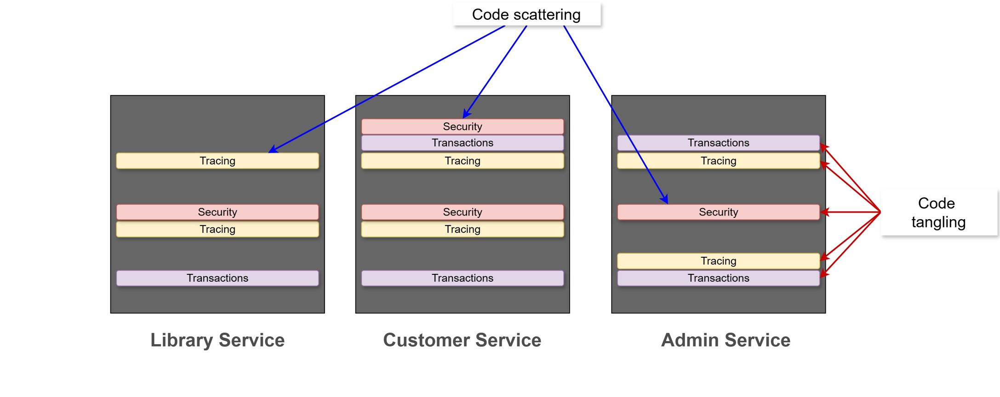
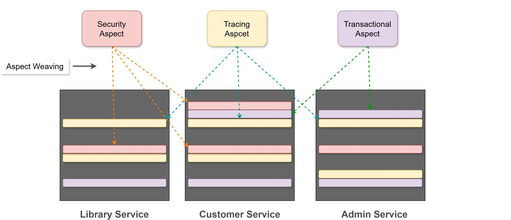

# Introduction

The AOP complements OOP by providing another way of thinking about program structure.
The AOP enables modularization of cross-cutting concerns

* To avoid code tangling
* To eliminate code scattering

The Cross-cutting concerns represent general application functionality that is needed in many places

* Logging and Tracing
* Transaction Management
* Security
* Caching
* Performance Monitoring

## How AOP works

* Implement your main application logic
    * Focus on the core application functionality
* Write aspects to implement cross-cutting concerns
* Weave the aspects into your application
    * Adding the cross-cutting functionality to the right places

## CCC Modularization

From:

To:

