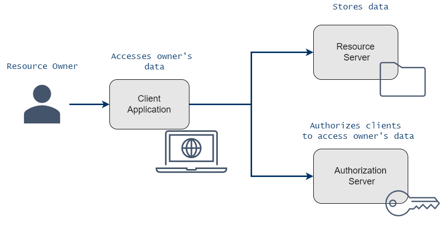
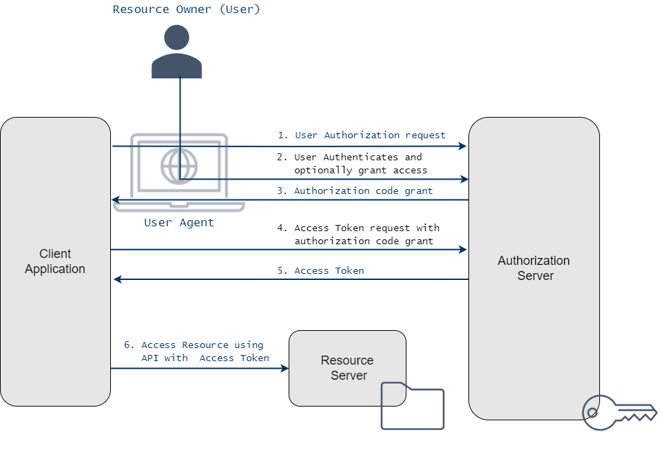

# OAuth 2.0

The OAuth2.0 framework enables clients to use resource servers on behalf of resource owners. 

Example: A diagram design application wants to use your Google disk to store projects.

* Authorization framework
* Created for delegated Authorization scenarios
* Enables an application to obtain authorization to call APIs
* Application can obtain User’s consent to call APIs on User’s behalf
* Application can obtain authorization to call APIs on its own behalf
* IETF standard
* It defines Authorization flows
* It does not deal with Identities
* It **is not** Authentication protocol

## Basic concept

The OAuth2.0 framework defines following roles:

* **Resource Server**:  A service (with an API) storing protected resources to be accessed by an application.
* **Resource Owner**:A user or other entity that owns protected resources at the resource server.
* **Client**: An application which needs to access resources at the resource server, on the resource owner’s behalf or on its own behalf.
* **Authorization Server**: A service trusted by the resource server. It authenticates the application or resource owner and requests consent from the resource owner if the application will make requests on the resource owner’s behalf. 

## Clients

Based on the cabability to securely store secrets the OAuth2.0 distinquish between Confidential and Public clients:

* **Confidential Client**: An application that runs on a protected server and can securely store confidential secrets to authenticate itself to an authorization server.
    * Backend module
    * Application Load Balancer

* **Public Client**: An application that executes primarily on the user’s client device (native application) or in the client browser and cannot securely store a secret or use other means to authenticate itself to an authorization server.
    * SPA web application
    * Native mobile application

## Tokens

There are various Tokens with specific purpose used by the framework.

* **Access Token**: A token used by an application to access an API. It represents the application’s authorization to call an API and has an expiration.

* **Refresh Token**: An optional token that can be used by an application to request a new access token when a prior access token has expired.

* **Authorization Code**: An intermediary, opaque code returned to an application and used to obtain an access token and optionally a refresh token. Each authorization code is used once.

## Authorization Grants

The authorization grants are methods by which applications obtain authorization to call an API.

* **Authorization Code**: Used by clients to exchange an authorization code for an access token. 
    * PKCE (Proof Key for Code Exchange) extension to the Authorization Code flow to prevent CSRF and authorization code injection attacks

* **Client Credentials**: Used by clients to obtain an access token outside of the context of a user.

* **Device Code**: Enables devices with no browser or limited input capability to obtain an access token.

* **Refresh Token**: Used by clients to exchange a refresh token for an access token when the access token has expired

Authorization code grant flow:

